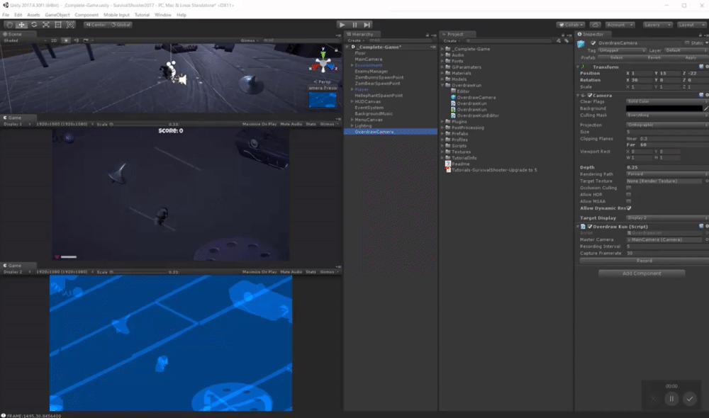
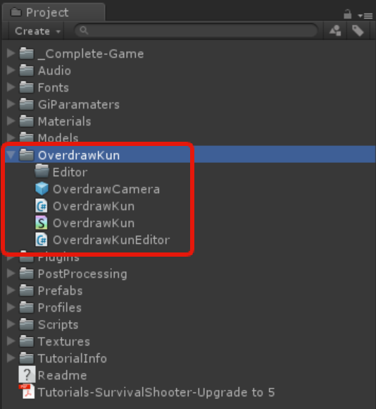
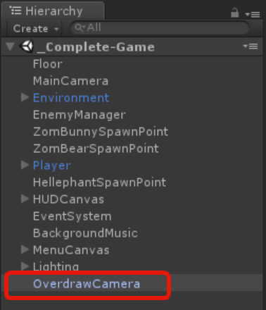
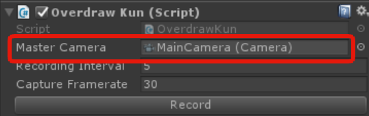
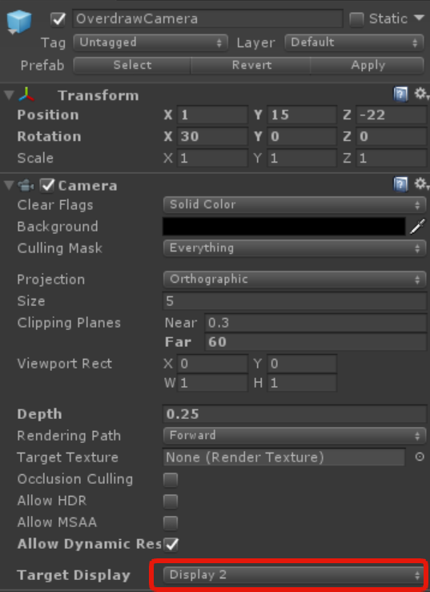
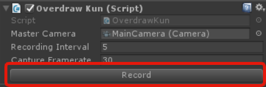
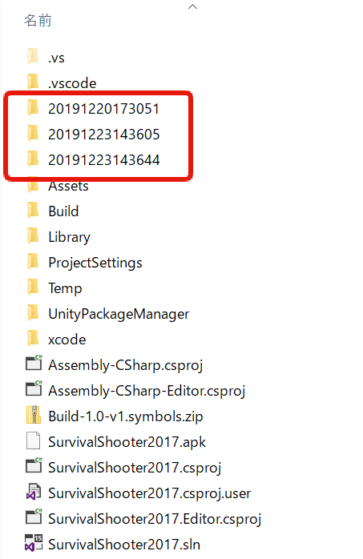
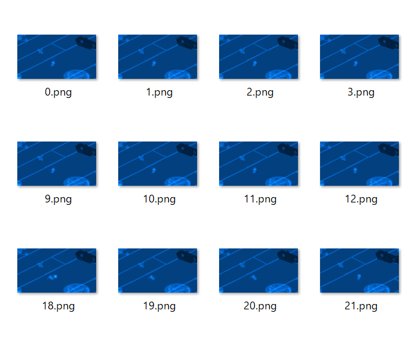

# UnityOverDrawKun

overdraw check tool.

## Summary

Tool that allows to measures the overdraw when rendering. 
It can be measured only on platforms that support multiple displays. 

## Install

Place the `UnityOverDrawKun` under Asset folder like the image below: 

## Setting

- Place the `Overdraw Camera` inside in folder to the Scene you wish to measure. 

- Specify the camera to be measured in `OverdrawCamera.MasterCamera`. 

- Please display two or more GameViews. The Game view can be created by selecting Add Tab > Game. 

- Set the Target Display property of the Camera component attached to `OverdrawCamera` other than Display1. 
 

## Measurement Method

- By pressing the Play button, the measurement result will be displayed in the GameView specified in OverdrawCamera.Camera.Target Display.
- The brighter measurement result look dsiplays in the screen is where overdrawing has occured. 
- You can save the measurement result by pressing the OverDrawKun.Record button attached to the Overdraw Camera from the inspector. 
  

  
 The measurement result gets outputted by creating a YYTTMMDDHHMM folder under the project folder.
 

 
 

## Analysis of measurement results

It is possible to analyze the measurement result with UnityOverdrawKunWindow.

### Window starting method

Open Window->UnityOverdrawKun.

### How to capture measurement results

Open the directory where the measurement results are saved from the Open Folder icon on the upper left of the window.

### How to check the measurement result

By sliding the slide bar at the bottom of the screen, you can check the degree of overdraw that are occuring each frame.

### How to save in CSV format

Press Save As CSV button at the top of the screen.

## Other
Comments and feedback are welcome! 
